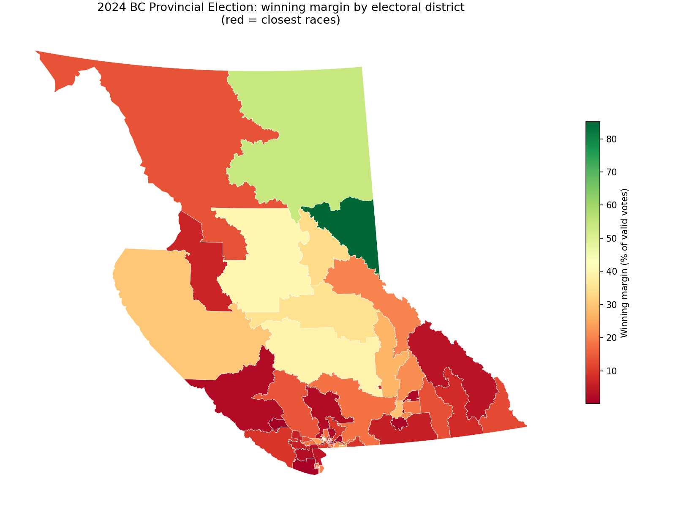
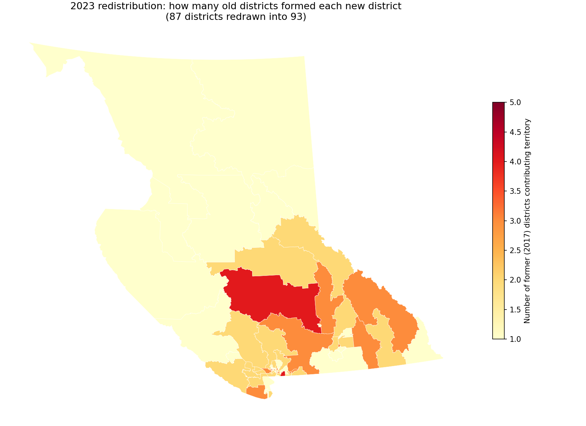

# BC Electoral Geography: Assigning Places to Districts

A PostgreSQL/PostGIS analysis of British Columbia's electoral geography: spatial assignment of locations to electoral districts, the impact of the 2023 electoral redistribution (87 → 93 districts), and the 2024 Provincial General Election results.

**Data:** Elections BC open data via the BC Geographic Data Warehouse — electoral district boundaries (2015 and 2023 redistributions), voting places (4,354 points), and official voting results by voting place. Licence: Elections BC Open Data Licence.

## Key Findings

1. **Point-in-polygon assignment matches official district assignments 84.5% of the time — and the mismatches are a feature, not a bug.** Roughly 15% of voting places physically sit in a different district than the one they serve (e.g., facilities just across a boundary, like a Coquitlam-Burke Mountain voting place located in Port Coquitlam). This quantifies why Elections BC warns that spatial data alone must not determine a voter's district: authoritative assignment requires address reference data, with geometry as a validation layer.

2. **The 2023 redistribution redrew most of the map.** Of the 87 old districts, only 30 passed intact to a single successor; 36 split in two and 21 fragmented into three or more pieces. On the other side, 55 of the 93 new districts merged territory from multiple old districts. A "mixed-origin score" ranks the new districts where voter communication about boundary changes mattered most.

3. **The 2024 election was decided at razor-thin margins on the new map.** Surrey-Guildford was won by 22 votes (0.12%), Kelowna Centre by 40, and Courtenay-Comox by 93 — computed from 2.08M valid votes with window functions and validated against official results.





## What This Demonstrates

- **Relational databases:** schema design, bulk loading (`ogr2ogr`, `\copy`), indexes (including GIST spatial indexes), CTEs, window functions (`RANK`, `LEAD`), views.
- **GIS / spatial databases:** PostGIS `ST_Contains` point-in-polygon joins, `ST_Intersection`/`ST_Area` overlay analysis in an equal-area projection (EPSG:3005 BC Albers — chosen deliberately, since area math in geographic coordinates would be wrong), spatial validation against authoritative assignments.
- **Domain judgment:** understanding that facility location ≠ served district, that 2024 results are reported by voting place rather than voting area under the new voting administration model, and that sliver overlaps (<1%) must be filtered from redistribution analysis.

## Project Structure

```
├── data/                            # source GeoJSON/shapefile extracts (not in repo)
├── images/                          # maps generated from the analysis
├── sql/
│   ├── 01_schema_and_load.sql       # PostGIS setup, ogr2ogr load, results table
│   ├── 02_spatial_assignment.sql    # ST_Contains assignment + validation vs official
│   ├── 03_redistribution_analysis.sql  # 87 -> 93 overlap matrix, splits and merges
│   └── 04_election_results.sql      # margins, seats, voting-opportunity mix
└── README.md
```

## How to Reproduce

1. Download the boundary sets (2015 and 2023 redistributions), voting places, and voting results from [Elections BC's GIS data page](https://elections.bc.ca/resources/maps/gis-spatial-data/) and the [BC Data Catalogue](https://catalogue.data.gov.bc.ca/), placing extracts in `data/`.
2. Create the database and load:

```bash
createdb bc_electoral
psql -d bc_electoral -c "CREATE EXTENSION postgis"
# run the ogr2ogr commands documented in sql/01_schema_and_load.sql
psql -d bc_electoral -f sql/01_schema_and_load.sql
psql -d bc_electoral -c "\copy voting_results_raw FROM 'provincial_voting_results_by_voting_place.csv' WITH (FORMAT csv, HEADER true)"
psql -d bc_electoral -f sql/02_spatial_assignment.sql
psql -d bc_electoral -f sql/03_redistribution_analysis.sql
psql -d bc_electoral -f sql/04_election_results.sql
```

## Notes & Limitations

- Voting place points are from the 2020 event cycle; their official district assignments reference the 2015 redistribution boundaries, which is exactly what makes the two-boundary-set validation possible.
- 2024 results are reported by voting place (not voting area) under the province's new voting administration model; out-of-district and absentee categories are reported separately.
- Spatial data is used here for analysis and validation, not to determine any voter's actual district — consistent with Elections BC's guidance.

## Author

Aysegul Dahi — [LinkedIn](https://linkedin.com/in/ayseguldahi) · [GitHub](https://github.com/ayseguldahi)
